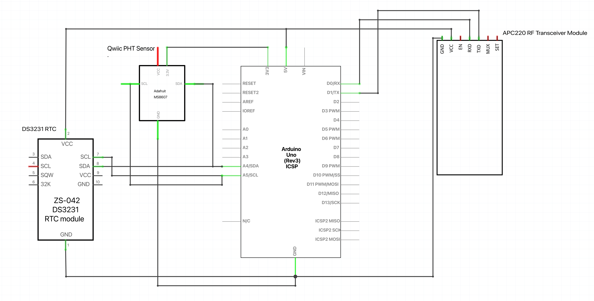

# PCC-MATE-ROV-FLOAT
Repo for development of vertical profiling float codebase.

Push all untested code the `develop` branch. Only merge code into the main branch once it has been thoroughly tested by the team! `develop` will likely end up being 50 commits ahead of main and that's totally normal. When our future teammates pull from the `main` branch, we want them to pull rock solid, reliable code.    

The competition will be held from June 20-22 in Kingsport, Tennessee. Here's the [briefing document](https://20693798.fs1.hubspotusercontent-na1.net/hubfs/20693798/2024_MATE_ROV_Competition_Briefing_Final.pdf) with the competition requirements. Please checkout the [previous years float designs](https://drive.google.com/drive/folders/121Tz7x0-EfkKMqCjBjuEYqYDveyaxTBM) for inspiration, lots of great design ideas there!  

###### Current Hardware Resources:
- [APC220 Radio Communication Module](https://www.dfrobot.com/product-57.html)
- [DS3231 RTC Module](https://www.analog.com/media/en/technical-documentation/data-sheets/ds3231.pdf)
- [PHT Sensor](https://www.sparkfun.com/products/16298)

###### Team Documentation:
- [EECS Development Documentation](https://docs.google.com/document/d/1Vk6bKeaP4gRqM1nAKLwqZ9u9HDtNymwOhbvJlox1gg0/edit)
- [Meeting Notes](https://docs.google.com/document/d/15WfaYZ0gR8IHrVPzwOAMRuCWtq1-5K_dWC4vAp4XaMg/edit)

###### Wiring Schematic(WIP, subject to change):

